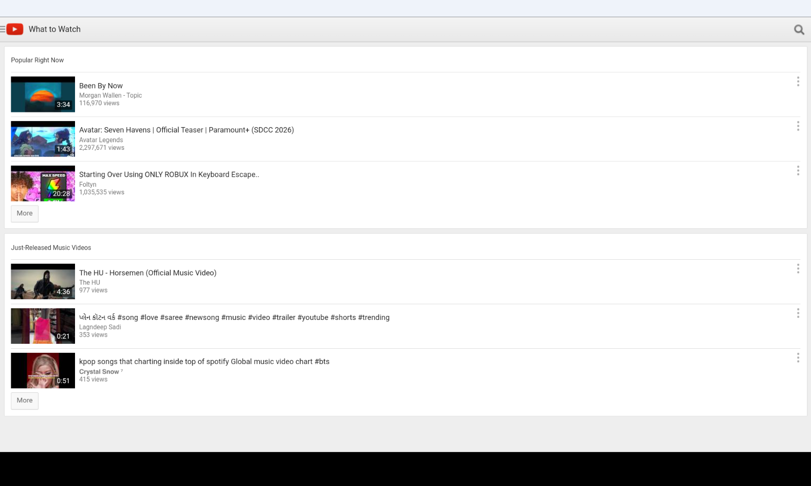
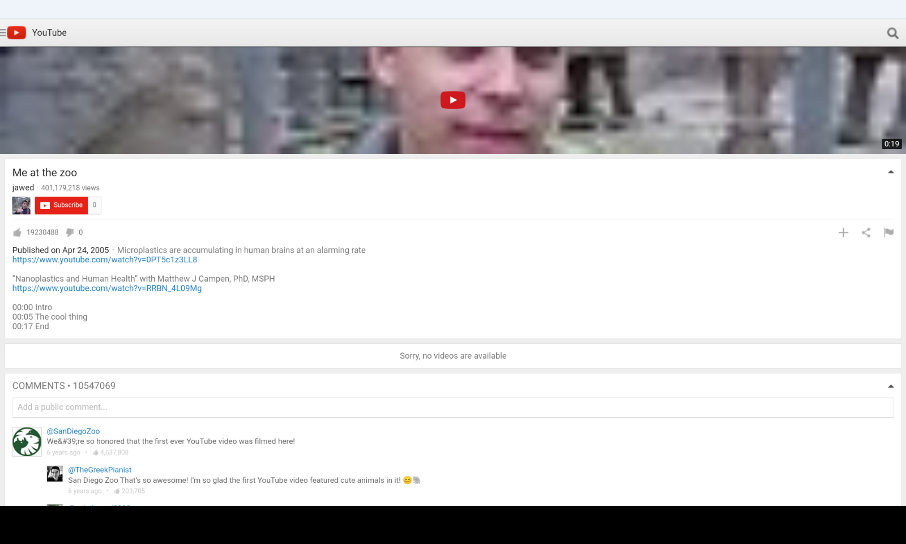
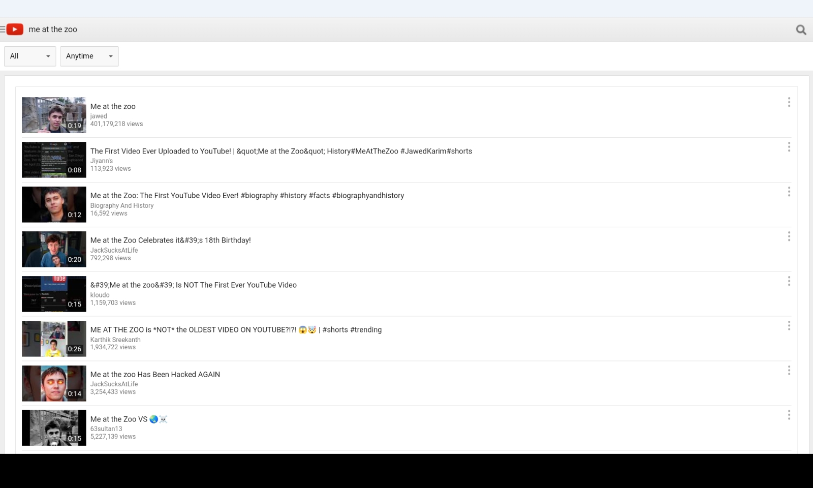
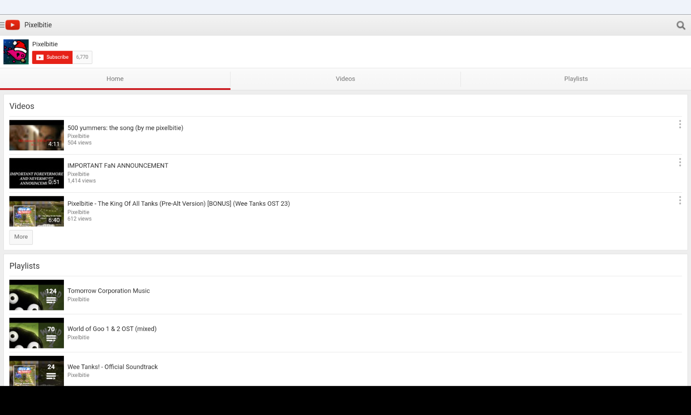
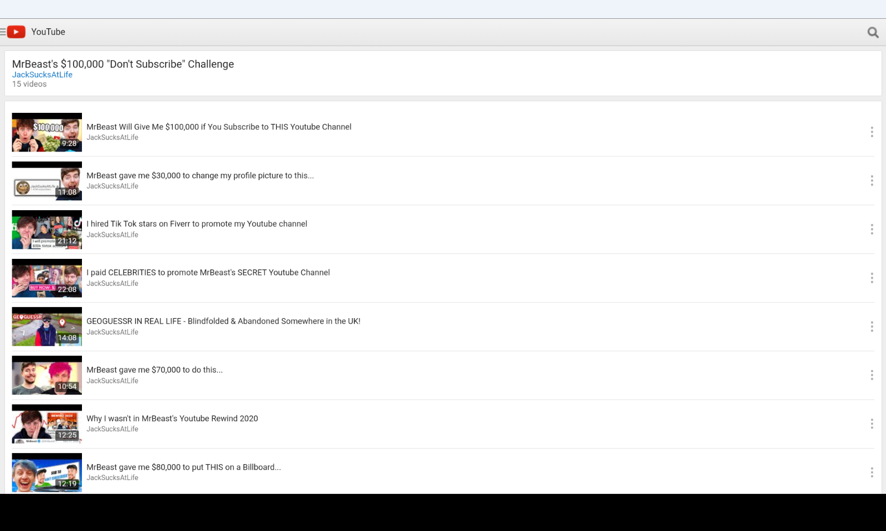

<h1 align="center">2015MTube</h1>
This project revives the YouTube mobile web client (m.youtube.com) by recreating its API.

- What API for getting information
  - YouTube Data API v3
- What working
  - Watch, Search, Channels, Playlists, AJAX (WIP)

This project in developing, but you can contribute

Planing:
- Sign in

## Installation
[Installation](installation.md)
